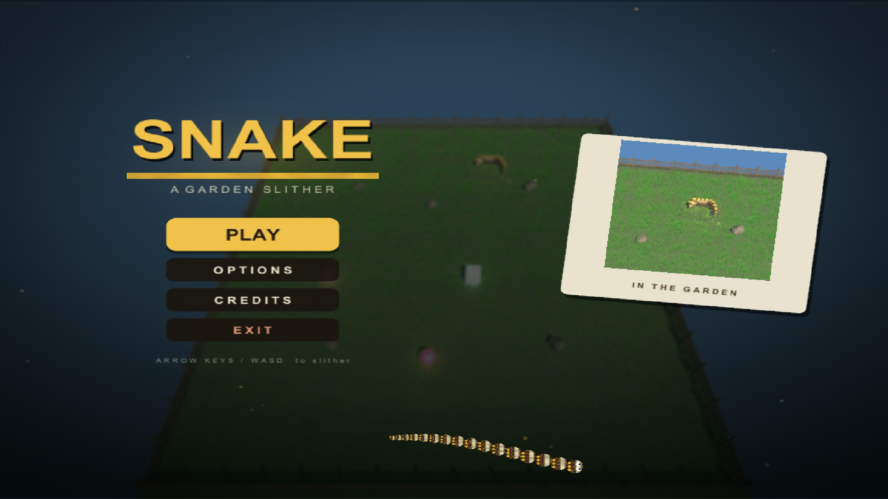
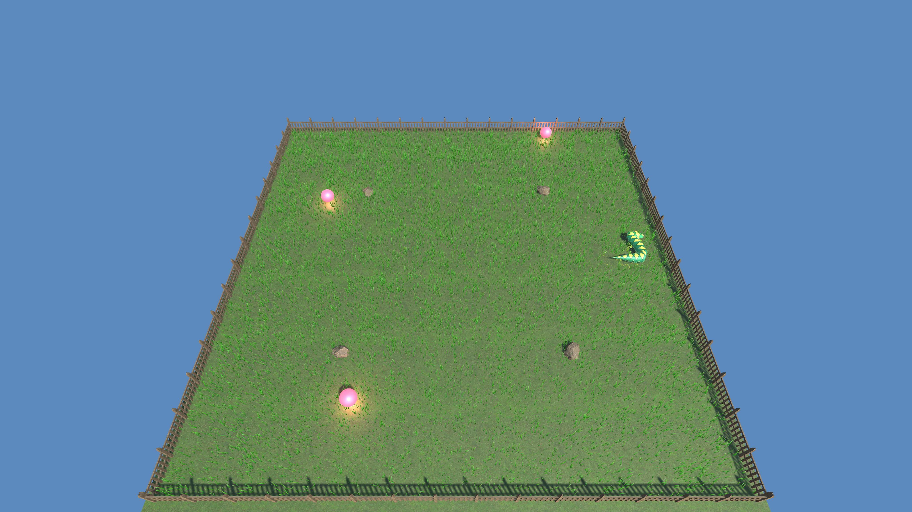
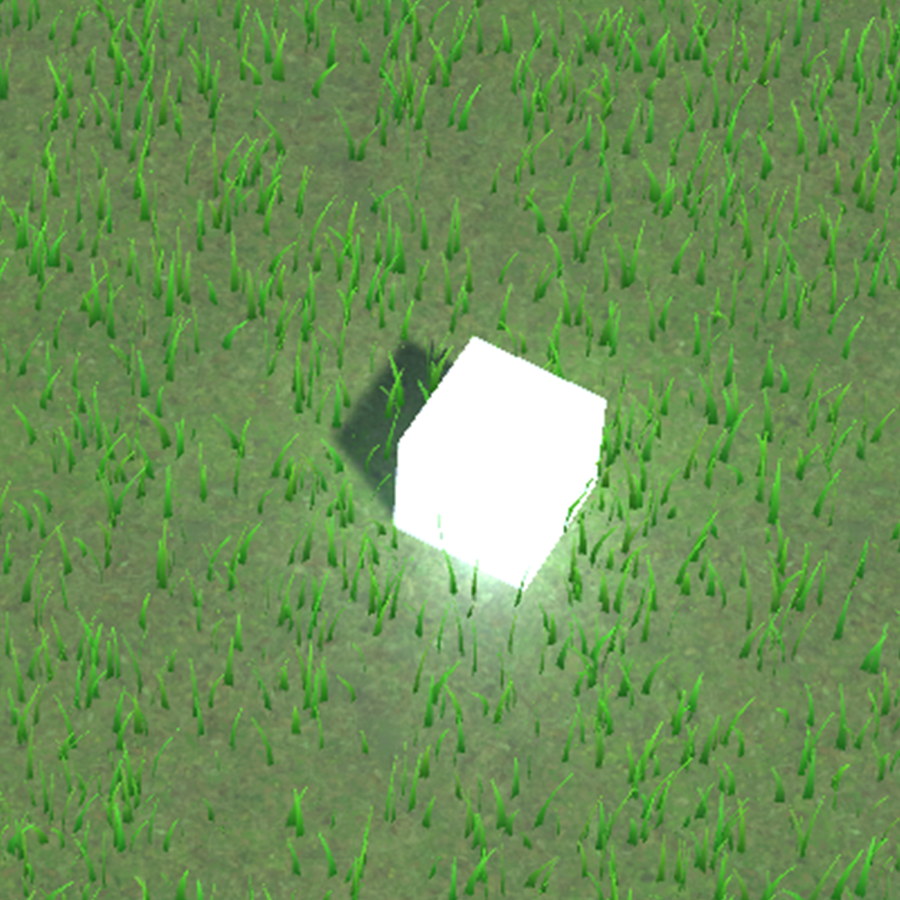
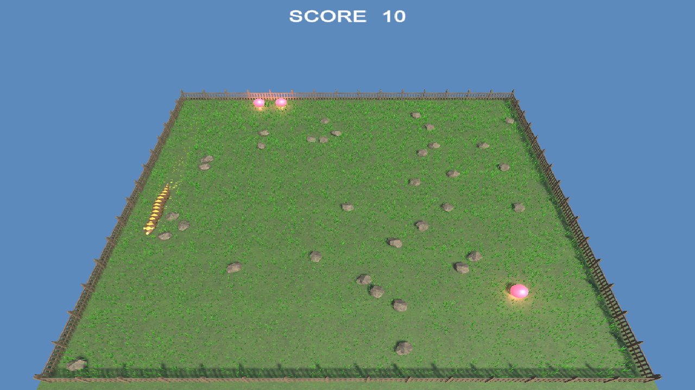

# 🐍 Snake Garden Slither

**A 3D Snake Game Built with Unity & C# — Made 100% with AI**  
*An experiment to test the power of AI in game development — from an empty scene to a finished, polished game, purely with AI.*

---

## 🤖 Made Purely with AI

This project was created **purely using AI** as an experiment to **test the power of AI in game development** — what it can actually do when given full control of a project.

- Every script, shader, procedural mesh, sound cue, UI screen, and design decision was generated and iterated on by AI.
- I acted purely as a director and tester: giving goals like *"make the sky look like a real sky"*, *"turning must be precise — no grid snapping"*, or *"fix the snake eating its own tail on a double press"*, and reviewing the results.
- The goal was simple: **see what AI can do in game dev — and just test AI.**

---

## 🎮 Game Overview

**Snake Garden Slither** is a classic snake game reimagined in a **3D low-poly garden**.  
Steer your gold-diamond snake across the lawn, eat apples to grow, dodge sliding rocks and your own growing tail, and grab power-ups to survive as long as you can.

The garden itself is alive: grass bends and springs back under the snake, clouds drift across a gradient sky, and everything from the rocks to the fence is generated procedurally in code.

---

## ✨ Key Features

- **Precise, Fluid Turning**
  - Catmull-Rom spline movement with render smoothing — rounded corners, zero grid snapping
  - Rapid double-press input protection (no accidental self-collision)
- **Living Garden Environment**
  - Custom bend-and-spring-back grass shader
  - Natural wooden fence, gradient skybox, procedurally generated drifting clouds
- **Polished Snake**
  - Slithering body tube, curved head, flicking tongue, gold-diamond skin on brown
- **Obstacles & Power-Ups**
  - Procedural low-poly rocks that slide across the field, with smash debris
  - Power-ups including the RockHead ability
- **Full Game Shell**
  - Main menu (Play / Options / Credits / Exit), background music, action sound effects, score HUD
- **Everything Procedural**
  - Rocks, grass, fence, clouds, and meshes are all generated in code — no heavy asset packs

---

## 🕹️ Controls

| Key | Action |
|----|-------|
| W / ↑ | Turn up |
| S / ↓ | Turn down |
| A / ← | Turn left |
| D / → | Turn right |
| Mouse | Menu buttons (Play / Options / Credits / Exit) |

---

## 🛠️ Technical Details

- **Engine:** Unity 6 (Built-in Render Pipeline), C#
- **Genre:** 3D Arcade / Snake
- **Platform:** Windows
- **Focus Areas:**
  - Spline-based movement & input validation
  - Custom shaders (bending grass, gradient sky, soft clouds)
  - Procedural mesh generation & object pooling
  - Runtime UI construction and audio management

---

## 📸 Screenshots

> *(Main menu, garden gameplay, power-ups, and obstacles)*

---

## 🎯 AI Experiment — What It Showed

Testing AI on a real game project demonstrated that AI can:

- Take a project from **an empty scene to a complete, polished game loop** (menu → gameplay → audio → effects)
- Write and debug its own code iteratively — finding root causes (e.g., frame-perfect input bugs) from player reports alone
- Design custom shaders and procedural systems without any purchased assets
- Hold a consistent art direction and feature set across a long, multi-session project

The biggest lesson: **AI is extremely capable at execution — the human's role shifts to direction, taste, and testing.**

---

## 📄 Notes

- This project is intended for **educational and portfolio purposes**.
- All assets are either **CC0 (free) resources or procedurally generated** in code.
- This repo exists as a record of an **AI game-development experiment**.

---

## 📫 Contact

**Kushwaha Rajat Kamalakant**  
📧 Email: rajatkshwh131@gmail.com  
🔗 LinkedIn: https://www.linkedin.com/in/kushwaha-rajat/

---
